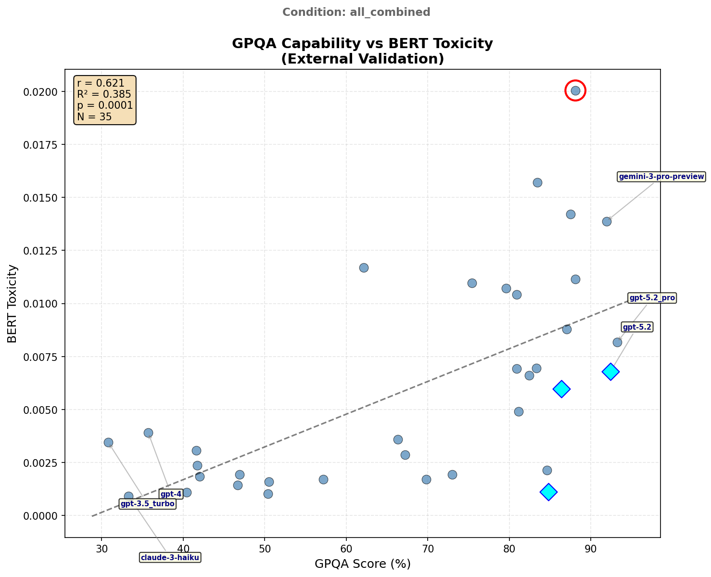

# GPQA vs BERT Toxicity Correlation (All Combined)

## Executive Summary

External validation correlating GPQA benchmark performance with BERT-detected toxicity across all experimental conditions combined.

| Metric | Value |
|--------|-------|
| Pearson r | **0.621** |
| p-value | 6.92e-05 |
| R² | 38.5% |
| Effect Size | Large |
| N (matched) | 35 |

**Finding**: Large positive correlation - the strongest GPQA-toxicity relationship observed across conditions. Aggregating data across conditions reveals a robust capability-toxicity pathway.

**Important Caveat**: See [Score Magnitude Context](#score-magnitude-context) below regarding interpretation of absolute toxicity values.

---

## Visualization

---

## Results

### Correlation Statistics

| Statistic | Value | Interpretation |
|-----------|-------|----------------|
| Pearson r | 0.6208 | Large positive |
| p-value | 6.92e-05 | Highly significant |
| R² | 0.3854 | 38.5% variance explained |

### Pattern Detection

**Outliers** (|residual| > 2 SD):
- GPT-5.1 - Deviates from expected relationship

**Constrained** (High GPQA, suppressed toxicity):
- Models achieving high capability with lower-than-expected toxicity

---

## Cross-Condition Comparison

| Condition | r | p | N | Effect |
|-----------|---|---|---|--------|
| **all_combined** | **0.621** | <.001 | 35 | **Large** |
| naturalistic | 0.455 | .007 | 34 | Medium |
| baseline | 0.423 | .011 | 35 | Medium |

**Interpretation**: Aggregating across conditions strengthens the GPQA-toxicity correlation (r increases from 0.42-0.45 to 0.62), suggesting the relationship is robust and stabilizes with more data.

---

## Score Magnitude Context

### Absolute Toxicity Levels

| Statistic | Value | Context |
|-----------|-------|---------|
| Max toxicity | 0.020 | Top 2% of BERT scale |
| Mean toxicity | 0.006 | Bottom 1% of BERT scale |
| Min toxicity | 0.001 | Near floor |
| Scale range | 0-1 | Trained on Jigsaw toxic comments |

### Interpretation Caveats

1. **Floor effect**: All LLM responses score in the bottom 1-4% of BERT's toxicity scale. For reference, explicitly toxic comments in BERT's training data score 0.5-1.0. These models are *extremely* non-toxic by that standard.

2. **Relative, not absolute**: The correlation (r=0.62) captures *relative* rank-order differences between models. The highest-toxicity model (~0.02) is ~20x more toxic than the lowest (~0.001), but both are trivially low in absolute terms.

3. **Sensitivity limitation**: BERT may lack sensitivity at the low end of its scale. Behavioral differences we detect (disinhibition, boundary-pushing) may manifest in ways BERT wasn't trained to recognize (subtlety, edge-cases vs explicit slurs).

4. **Validation still meaningful**: Despite floor effects, significant correlations validate that judge-assessed behavioral dimensions track *something* BERT also detects, even within a narrow low-toxicity band.

**Bottom line**: These correlations reflect rank-order relationships within a very narrow, low-toxicity range—not clinically meaningful toxicity levels.

---

## Data Provenance & Audit Trail

### Source Files

| File | Purpose |
|------|---------|
| `bert_validation_results.json` | BERT toxicity scores (all conditions) |
| `limitations/external_evals/gpqa_validation_analysis.json` | GPQA benchmark data |

### Audit Files

| File | Description |
|------|-------------|
| `gpqa_bert_correlation_audit.json` | Complete reproducibility data |

---

*Generated: 2026-01-23*
