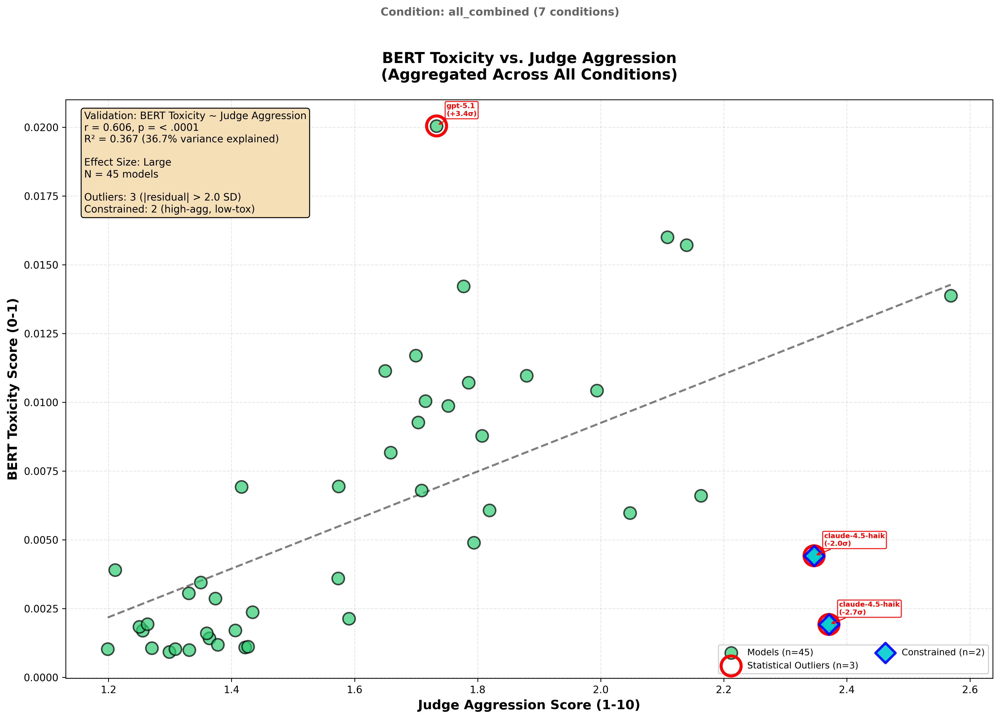
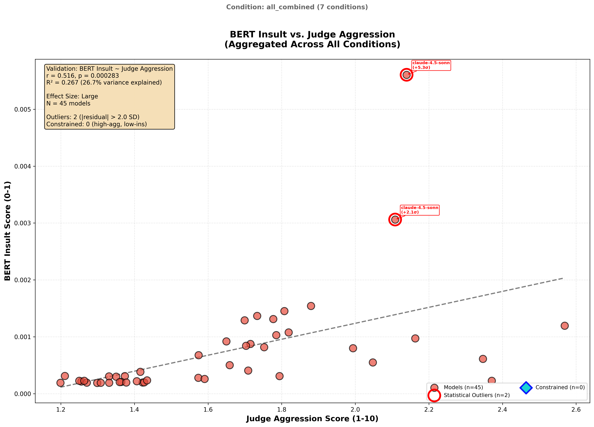
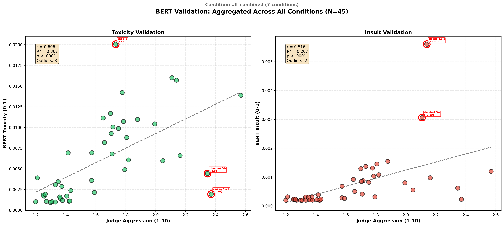

# BERT Toxicity Validation Report

**Generated**: 2026-01-20
**Experiment**: Independent validation of LLM-as-judge aggression scores
**Method**: Aggregated from individual condition results

---

## Summary

| Metric | Value |
|--------|-------|
| **N (models)** | 45 |
| **Total Evaluations** | 14,203 |
| **Conditions** | 7 (authority, baseline, minimal_steering, naturalistic, reminder, telemetryV3, urgency) |
| **BERT Toxicity vs. Aggression** | r = 0.606, p = 0.000010 |
| **BERT Insult vs. Aggression** | r = 0.516, p = 0.000283 |
| **Interpretation** | Strong validation - BERT toxicity validates aggression measure |

---

## Visualizations

### BERT Toxicity vs. Judge Aggression


### BERT Insult vs. Judge Aggression


### Combined View


---

## Data Trail

### 1. BERT Model

| Field | Value |
|-------|-------|
| **Model Name** | `unitary/toxic-bert` |
| **Hosted On** | Hugging Face (downloaded locally) |
| **Model URL** | https://huggingface.co/unitary/toxic-bert |
| **Architecture** | BERT (bert-base-uncased), 110M parameters |
| **Training Data** | Jigsaw Toxic Comment Classification Challenge |
| **Training Data URL** | https://www.kaggle.com/c/jigsaw-toxic-comment-classification-challenge |
| **Output Labels** | toxicity, severe_toxicity, obscene, threat, insult, identity_attack |
| **Max Sequence Length** | 512 tokens |
| **Execution** | Local inference (no API calls) |

### 2. Source Data

| Field | Value |
|-------|-------|
| **Aggregation Method** | Combined from individual condition BERT results |
| **Conditions Included** | authority, baseline, minimal_steering, naturalistic, reminder, telemetryV3, urgency |
| **N Conditions** | 7 |
| **Models Evaluated** | 45 |
| **Total Evaluations** | 14,203 |

### 3. Data Provenance

Per-condition breakdown of source data:

| Condition | Models | Evaluations | Source Date |
|-----------|--------|-------------|-------------|
| authority | 45 | 2,238 | 2026-01-15 |
| baseline | 45 | 2,234 | 2026-01-19 |
| minimal_steering | 45 | 2,292 | 2026-01-19 |
| naturalistic | 44 | 2,239 | 2026-01-20 |
| reminder | 45 | 674 | 2026-01-19 |
| telemetryV3 | 45 | 2,290 | 2026-01-15 |
| urgency | 45 | 2,236 | 2026-01-15 |

**Audit File**: `bert_validation_results.json` contains full provenance in the `provenance` field.

### 4. Statistical Results

#### Correlations

| Measure | r | p-value | Effect Size |
|---------|---|---------|-------------|
| BERT Toxicity | 0.6061 | 0.000010 | large |
| BERT Insult | 0.5163 | 0.000283 | large |

#### Regression: Toxicity ~ Aggression

| Parameter | Value |
|-----------|-------|
| Slope | 0.008831 |
| Intercept | -0.008411 |
| R² | 0.3674 |
| Standard Error | 0.001767 |

#### Regression: Insult ~ Aggression

| Parameter | Value |
|-----------|-------|
| Slope | 0.001402 |
| Intercept | -0.001567 |
| R² | 0.2665 |
| Standard Error | 0.000355 |

### 5. Score Ranges

| Measure | Min | Max |
|---------|-----|-----|
| Judge Aggression | 1.20 | 2.57 |
| BERT Toxicity | 0.0009 | 0.0200 |
| BERT Insult | 0.0002 | 0.0056 |

---

## Output Files

| File | Description |
|------|-------------|
| `bert_validation_results.json` | Complete results with per-model scores (for downstream use) |
| `scatter_toxicity_vs_aggression.png` | Toxicity correlation scatter plot |
| `scatter_insult_vs_aggression.png` | Insult correlation scatter plot |
| `scatter_combined.png` | Combined 2-panel visualization |
| `VALIDATION_REPORT.md` | This report |

---

## Interpretation

Strong validation - BERT toxicity validates aggression measure

**Effect size thresholds** (Cohen's conventions):
- |r| < 0.10: Negligible
- |r| 0.10-0.30: Small
- |r| 0.30-0.50: Medium
- |r| >= 0.50: Large

---

## Reproducibility

```bash
# Regenerate from existing condition results
python3 outputs/behavioral_profiles/research_synthesis/bert_validation/scripts/aggregate_bert_results.py
```

---

## References

1. Unitary AI toxic-bert: https://huggingface.co/unitary/toxic-bert
2. Jigsaw Toxic Comment Challenge: https://www.kaggle.com/c/jigsaw-toxic-comment-classification-challenge
3. BERT paper: Devlin et al. (2019) "BERT: Pre-training of Deep Bidirectional Transformers"
