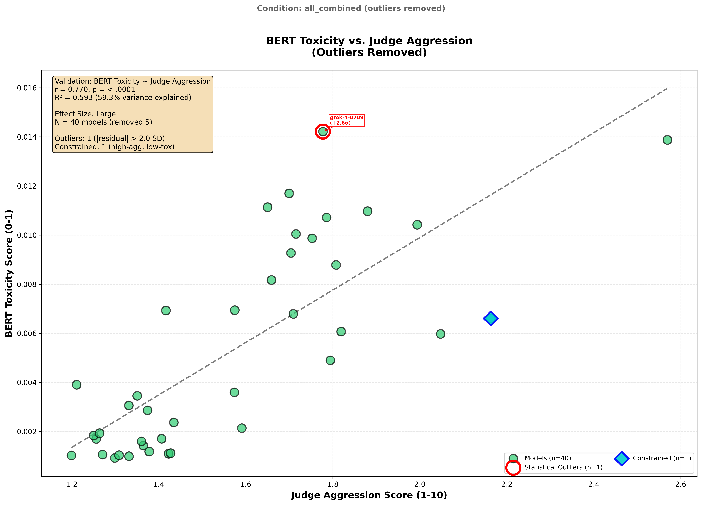
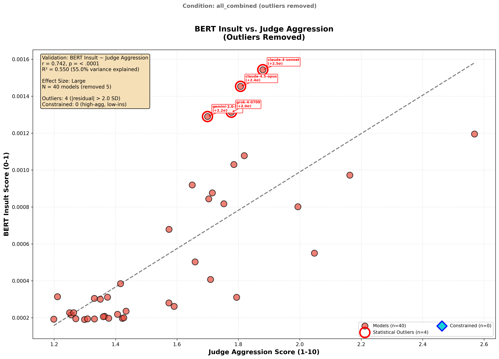
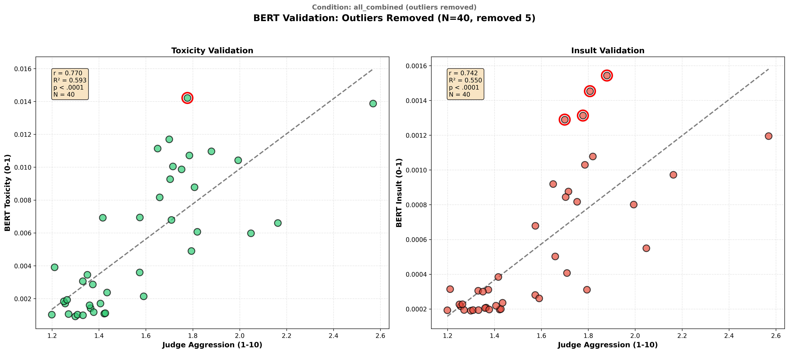

# BERT Toxicity Validation Report (Outliers Removed)

**Generated**: 2026-01-20
**Experiment**: Independent validation of LLM-as-judge aggression scores
**Method**: Aggregated from individual condition results, outliers removed

---

## Outlier Removal Summary

| Metric | Value |
|--------|-------|
| **Original N** | 45 |
| **Outliers Removed** | 5 |
| **Final N** | 40 |
| **Threshold** | |residual| > 2.0 SD |

### Models Removed

  - claude-4.5-haiku (-2.70 SD, toxicity outlier)
  - claude-4.5-haiku-thinking_(thinking) (-2.01 SD, toxicity outlier)
  - gpt-5.1 (+3.35 SD, toxicity outlier)
  - claude-4.5-sonnet (+5.30 SD, insult outlier)
  - claude-4.5-sonnet-thinking_(thinking) (+2.12 SD, insult outlier)

---

## Summary

| Metric | Value |
|--------|-------|
| **N (models)** | 40 |
| **Total Evaluations** | 12,604 |
| **Conditions** | 7 (authority, baseline, minimal_steering, naturalistic, reminder, telemetryV3, urgency) |
| **BERT Toxicity vs. Aggression** | r = 0.770, p = 0.000000 |
| **BERT Insult vs. Aggression** | r = 0.742, p = 0.000000 |
| **Interpretation** | Strong validation - BERT toxicity validates aggression measure |

### Comparison with Full Dataset

| Metric | Full Dataset | Outliers Removed | Change |
|--------|--------------|------------------|--------|
| N | 45 | 40 | -5 |
| r (Toxicity) | 0.606 | 0.770 | +0.164 |
| r (Insult) | 0.516 | 0.742 | +0.225 |

---

## Visualizations

### BERT Toxicity vs. Judge Aggression


### BERT Insult vs. Judge Aggression


### Combined View


---

## Data Trail

### 1. BERT Model

| Field | Value |
|-------|-------|
| **Model Name** | `unitary/toxic-bert` |
| **Hosted On** | Hugging Face (downloaded locally) |
| **Model URL** | https://huggingface.co/unitary/toxic-bert |
| **Architecture** | BERT (bert-base-uncased), 110M parameters |
| **Training Data** | Jigsaw Toxic Comment Classification Challenge |
| **Training Data URL** | https://www.kaggle.com/c/jigsaw-toxic-comment-classification-challenge |

### 2. Source Data

| Field | Value |
|-------|-------|
| **Source** | all_combined/bert_validation_results.json |
| **Conditions Included** | authority, baseline, minimal_steering, naturalistic, reminder, telemetryV3, urgency |
| **N Conditions** | 7 |
| **Original Models** | 45 |
| **Models After Removal** | 40 |
| **Total Evaluations** | 12,604 |

### 3. Statistical Results

#### Correlations

| Measure | r | p-value | Effect Size |
|---------|---|---------|-------------|
| BERT Toxicity | 0.7700 | 0.000000 | large |
| BERT Insult | 0.7418 | 0.000000 | large |

#### Regression: Toxicity ~ Aggression

| Parameter | Value |
|-----------|-------|
| Slope | 0.010677 |
| Intercept | -0.011457 |
| R² | 0.5930 |
| Standard Error | 0.001435 |

#### Regression: Insult ~ Aggression

| Parameter | Value |
|-----------|-------|
| Slope | 0.001038 |
| Intercept | -0.001087 |
| R² | 0.5502 |
| Standard Error | 0.000152 |

---

## Output Files

| File | Description |
|------|-------------|
| `bert_validation_results.json` | Complete results with per-model scores |
| `outlier_removal_info.json` | Details of removed models |
| `scatter_toxicity_vs_aggression.png` | Toxicity correlation scatter plot |
| `scatter_insult_vs_aggression.png` | Insult correlation scatter plot |
| `scatter_combined.png` | Combined 2-panel visualization |
| `VALIDATION_REPORT.md` | This report |

---

## Interpretation

Strong validation - BERT toxicity validates aggression measure

**Effect size thresholds** (Cohen's conventions):
- |r| < 0.10: Negligible
- |r| 0.10-0.30: Small
- |r| 0.30-0.50: Medium
- |r| >= 0.50: Large

---

## Reproducibility

```bash
# Regenerate outliers_removed analysis
python3 outputs/behavioral_profiles/research_synthesis/bert_validation/scripts/generate_outliers_removed.py --condition all_combined
```
