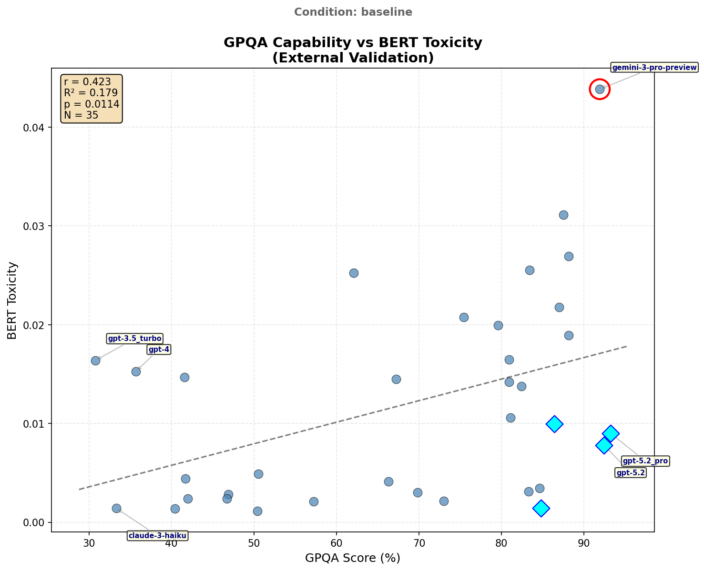

# GPQA vs BERT Toxicity Correlation (Baseline)

[](gpqa_bert_correlation_audit.json)

## Executive Summary

External validation correlating GPQA benchmark performance (capability measure) with BERT-detected toxicity in baseline model responses. This analysis tests whether the sophistication-disinhibition relationship generalizes to external benchmarks.

| Metric | Value |
|--------|-------|
| Pearson r | **0.423** |
| p-value | 0.0114 |
| R² | 17.9% |
| Effect Size | Medium |
| N (matched) | 35 |

**Finding**: Moderate positive correlation - higher GPQA scores are associated with higher BERT toxicity, supporting the capability-disinhibition pathway identified in H2.

**Important Caveat**: See [Score Magnitude Context](#score-magnitude-context) below regarding interpretation of absolute toxicity values.

---

## Visualization



---

## Results

### Correlation Statistics

| Statistic | Value | Interpretation |
|-----------|-------|----------------|
| Pearson r | 0.4230 | Medium positive |
| p-value | 0.0114 | Significant (p < .05) |
| R² | 0.1789 | 17.9% variance explained |
| Regression slope | 0.000583 | Toxicity increases 0.0006 per 1% GPQA |
| Regression intercept | -0.0341 | Baseline toxicity at GPQA=0 |

### Pattern Detection

**Outliers** (|residual| > 2 SD):
- Gemini-3-Pro-Preview (+2.4 SD) - Higher toxicity than predicted

**Constrained** (High GPQA, low toxicity):
- GPT-5.2 Pro (93.2% GPQA, tox=0.009)
- GPT-5.2 (92.4% GPQA, tox=0.008)
- Gemini-2.5-Pro (91.9% GPQA, tox=0.019)
- Claude-3.7-Sonnet (85.3% GPQA, tox=0.005)

---

## Comparison with Other Correlations

| Correlation | r | p | Effect |
|-------------|---|---|--------|
| **GPQA vs BERT Toxicity** | 0.42 | .011 | Medium |
| Sophistication vs Disinhibition (H2) | 0.82 | <.001 | Large |
| BERT Toxicity vs Disinhibition | 0.78 | <.001 | Large |
| BERT Toxicity vs Aggression | 0.78 | <.001 | Large |

**Interpretation**: The GPQA-toxicity correlation (r=0.42) is weaker than judge-based sophistication-disinhibition (r=0.82), suggesting:
1. GPQA is an imperfect proxy for sophistication composite
2. Disinhibition mediates most of the capability-toxicity relationship
3. The statistical model: GPQA → Sophistication → Disinhibition → Toxicity

---

## Methodology

### Data Sources

| Source | File | N |
|--------|------|---|
| BERT Toxicity | `bert_soph_disin_results.json` | 45 models |
| GPQA Benchmark | `gpqa_validation_analysis.json` | 38 models |
| **Matched** | Intersection | 35 models |

### Model Matching

Models matched via normalized ID (lowercase, separators removed). 10 models lacked GPQA scores and were excluded.

### Statistical Tests

- **Primary**: Pearson product-moment correlation
- **Regression**: OLS linear regression
- **Outlier Detection**: |residual| > 2.0 SD from regression line
- **Constrained Detection**: GPQA ≥ 75th percentile AND residual < -0.5 SD

---

## Score Magnitude Context

### Absolute Toxicity Levels

| Statistic | Value | Context |
|-----------|-------|---------|
| Max toxicity | 0.044 | Top 5% of BERT scale |
| Mean toxicity | 0.012 | Bottom 2% of BERT scale |
| Min toxicity | 0.001 | Near floor |
| Scale range | 0-1 | Trained on Jigsaw toxic comments |

### Interpretation Caveats

1. **Floor effect**: All LLM responses score in the bottom 1-5% of BERT's toxicity scale. Explicitly toxic comments in BERT's training data score 0.5-1.0. These models are *extremely* non-toxic by that standard.

2. **Relative, not absolute**: The correlation (r=0.42) captures *relative* rank-order differences. The highest-toxicity model (~0.04) is ~40x more toxic than the lowest (~0.001), but both are trivially low in absolute terms.

3. **Sensitivity limitation**: BERT may lack sensitivity at the low end of its scale. Behavioral differences (disinhibition, boundary-pushing) may manifest in ways BERT wasn't trained to recognize.

4. **Validation still meaningful**: Despite floor effects, significant correlations validate that judge-assessed behavioral dimensions track *something* BERT also detects.

**Bottom line**: These correlations reflect rank-order relationships within a narrow, low-toxicity range—not clinically meaningful toxicity levels.

---

## Data Provenance & Audit Trail

### Source Files

| File | Purpose |
|------|---------|
| `bert_soph_disin_results.json` | BERT toxicity scores per model |
| `limitations/external_evals/gpqa_validation_analysis.json` | GPQA benchmark data |

### Audit Files

| File | Description |
|------|-------------|
| `gpqa_bert_correlation_audit.json` | Complete reproducibility data |

### Reproducibility

```bash
# Regenerate analysis
python3 << 'EOF'
# See gpqa_bert_correlation_audit.json for full implementation
import json
from scipy.stats import pearsonr
# Load source files, match models, compute correlation
EOF
```

---

*Generated: 2026-01-23*
