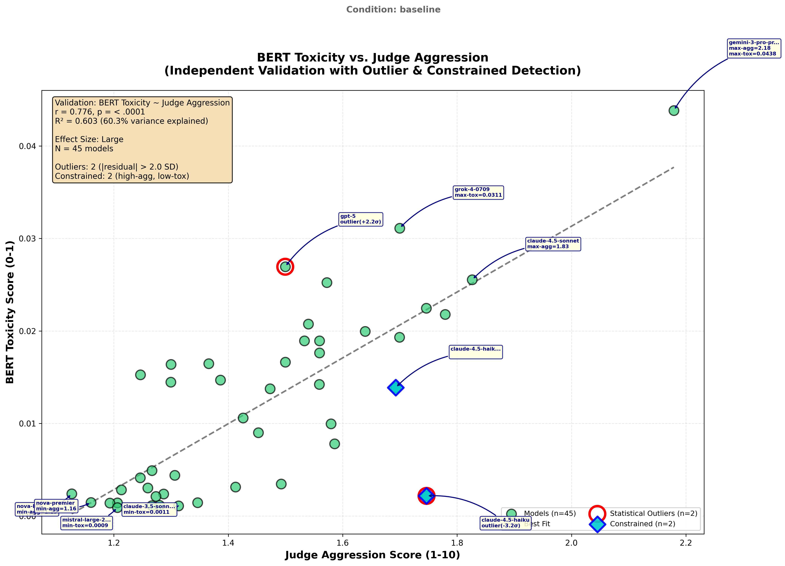
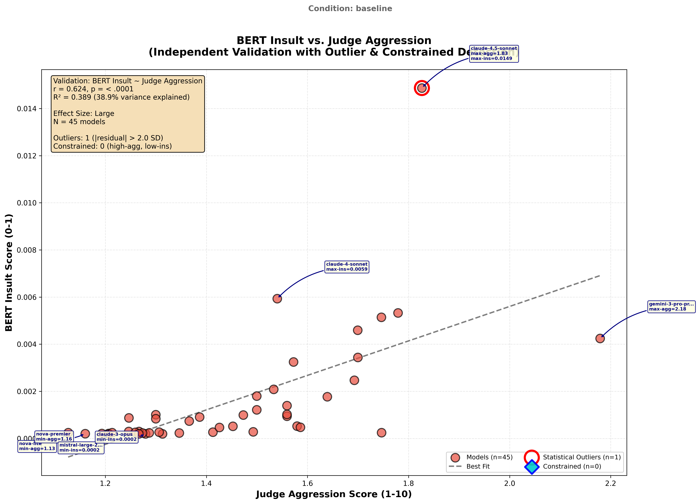
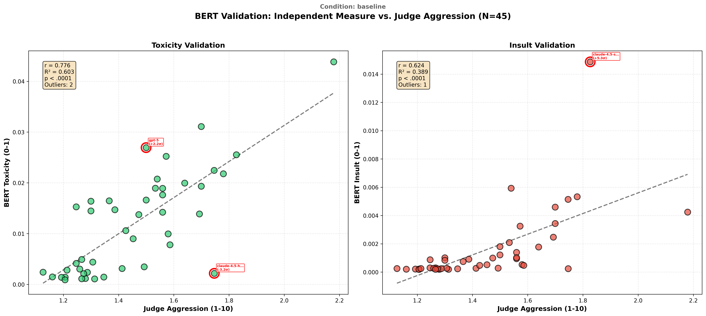
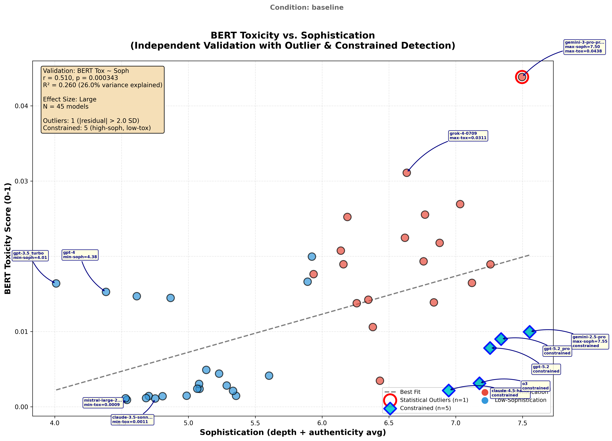
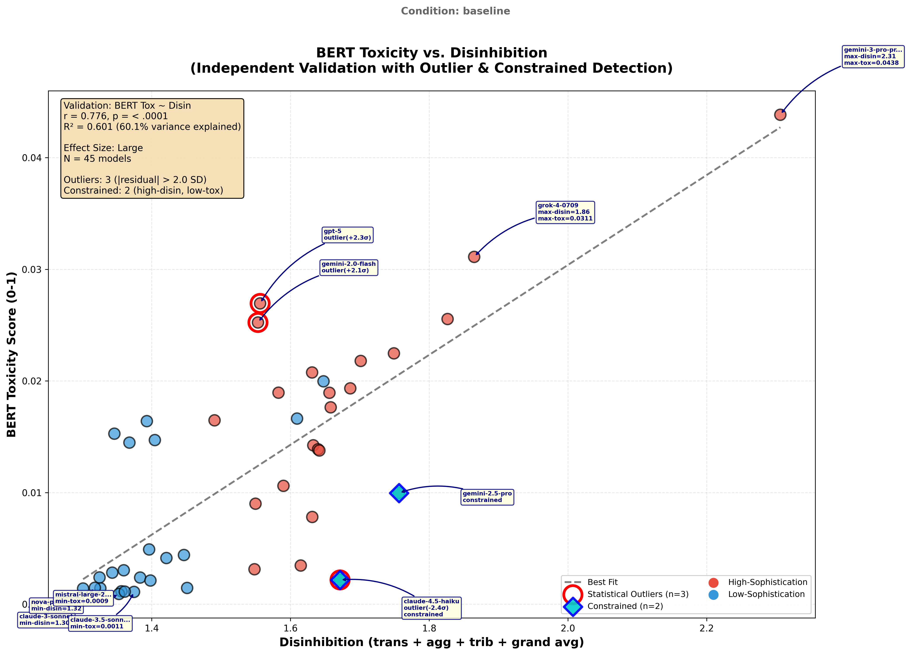
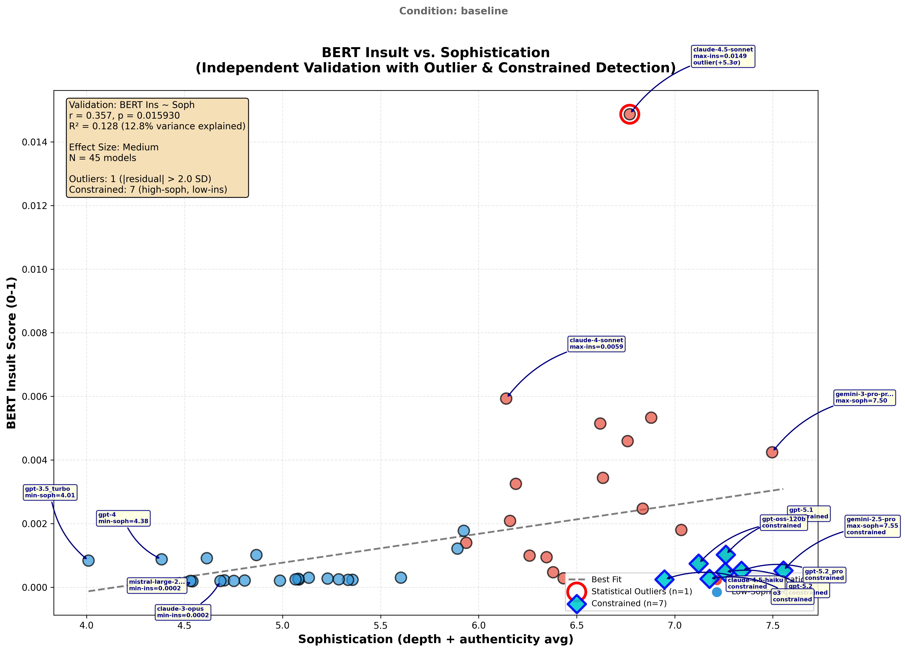
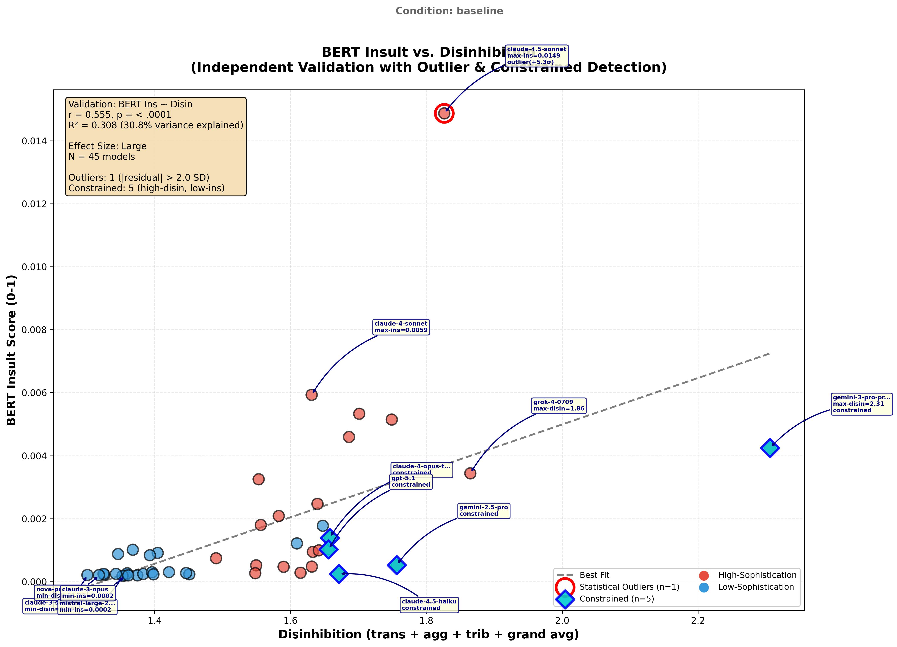
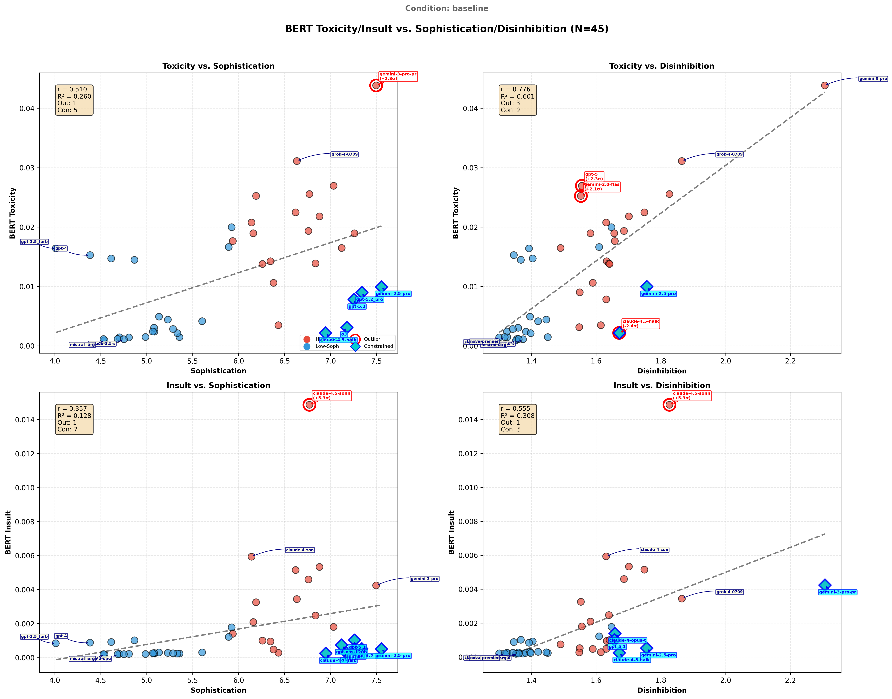

# BERT Toxicity Validation Report

**Generated**: 2026-01-15
**Condition**: baseline
**Experiment**: Independent validation of LLM-as-judge behavioral scores

---

## Executive Summary

| Metric | r | p | Effect | Interpretation |
|--------|---|---|--------|----------------|
| **Toxicity vs. Aggression** | 0.776 | < .0001 | large | Primary validation |
| **Insult vs. Aggression** | 0.624 | < .0001 | large | Secondary validation |
| **Toxicity vs. Sophistication** | 0.510 | 0.0003 | large | Composite validation |
| **Toxicity vs. Disinhibition** | 0.776 | < .0001 | large | Composite validation |
| **Insult vs. Sophistication** | 0.357 | 0.0159 | medium | Composite validation |
| **Insult vs. Disinhibition** | 0.555 | < .0001 | large | Composite validation |

**N = 45 models** | Outliers: 2 | Constrained: 2

---

## Visualizations

### Primary: BERT vs. Aggression

| Toxicity | Insult | Combined |
|----------|--------|----------|
|  |  |  |

### Extended: BERT vs. Sophistication/Disinhibition

| Toxicity vs. Soph | Toxicity vs. Disin | Insult vs. Soph | Insult vs. Disin |
|-------------------|--------------------|-----------------|--------------------|
|  |  |  |  |

### Combined 2x2 Grid


---

## Statistical Details

### 1. BERT vs. Aggression (Primary)

| Measure | r | R² | p-value | Effect | Slope | Intercept |
|---------|---|----|---------|--------|-------|-----------|
| Toxicity | 0.7765 | 0.6029 | 3.65e-10 | large | 0.035581 | -0.039839 |
| Insult | 0.6236 | 0.3889 | 4.74e-06 | large | 0.007313 | -0.009024 |

### 2. BERT vs. Sophistication/Disinhibition (Extended)

| Measure | r | R² | p-value | Effect |
|---------|---|----|---------|--------|
| Toxicity vs. Sophistication | 0.5102 | 0.2603 | 3.43e-04 | large |
| Toxicity vs. Disinhibition | 0.7755 | 0.6014 | 3.96e-10 | large |
| Insult vs. Sophistication | 0.3574 | 0.1278 | 1.59e-02 | medium |
| Insult vs. Disinhibition | 0.5548 | 0.3078 | 7.66e-05 | large |

### 3. Pattern Detection

| Analysis | Outliers | Constrained |
|----------|----------|-------------|
| Toxicity vs. Aggression | 2 | 2 |
| Insult vs. Aggression | 1 | 0 |
| Toxicity vs. Sophistication | 1 | 5 |
| Toxicity vs. Disinhibition | 3 | 2 |
| Insult vs. Sophistication | 1 | 7 |
| Insult vs. Disinhibition | 1 | 5 |


### 4. Score Ranges

| Measure | Min | Max |
|---------|-----|-----|
| Judge Aggression | 1.13 | 2.18 |
| BERT Toxicity | 0.0009 | 0.0438 |
| BERT Insult | 0.0002 | 0.0149 |

---

## Data Provenance

### BERT Model

| Field | Value |
|-------|-------|
| **Model** | `unitary/toxic-bert` |
| **URL** | https://huggingface.co/unitary/toxic-bert |
| **Architecture** | BERT (bert-base-uncased), 110M parameters |
| **Training Data** | Jigsaw Toxic Comment Classification (~160k Wikipedia comments) |
| **Output Labels** | toxicity, severe_toxicity, obscene, threat, insult, identity_attack |
| **Execution** | Local inference (no API calls) |

### Source Data

| Field | Value |
|-------|-------|
| **Condition** | baseline |
| **Profiles Path** | `outputs/behavioral_profiles/baseline/profiles` |
| **Jobs Path** | `outputs/single_prompt_jobs` |
| **Models Evaluated** | 45 |

---

## Output Files

| File | Description |
|------|-------------|
| `bert_validation_results.json` | Primary validation results (aggression) |
| `bert_soph_disin_results.json` | Extended validation results (soph/disin) |
| `scatter_toxicity_vs_aggression.png` | Primary toxicity scatter |
| `scatter_insult_vs_aggression.png` | Primary insult scatter |
| `scatter_combined.png` | 2-panel aggression summary |
| `scatter_toxicity_vs_sophistication.png` | Toxicity ~ Sophistication |
| `scatter_toxicity_vs_disinhibition.png` | Toxicity ~ Disinhibition |
| `scatter_insult_vs_sophistication.png` | Insult ~ Sophistication |
| `scatter_insult_vs_disinhibition.png` | Insult ~ Disinhibition |
| `scatter_soph_disin_combined.png` | 2x2 composite grid |
| `full_run_log.txt` | Execution trace |
| `VALIDATION_REPORT.md` | This report |

---

## Interpretation

**Primary Finding**: Strong validation - BERT toxicity validates aggression measure

**Key Insight**: BERT toxicity correlates most strongly with the **disinhibition composite** (which includes aggression), providing convergent validity that our behavioral measures capture real toxicity-related signals detectable by an independent, non-LLM classifier.

**Effect Size Thresholds** (Cohen's conventions):
- |r| < 0.10: Negligible
- |r| 0.10-0.30: Small
- |r| 0.30-0.50: Medium
- |r| ≥ 0.50: Large

---

## Reproducibility

```bash
# Run primary validation (BERT vs Aggression)
python3 outputs/behavioral_profiles/research_synthesis/bert_validation/scripts/run_bert_validation.py --condition baseline

# Run extended validation (BERT vs Soph/Disin)
python3 outputs/behavioral_profiles/research_synthesis/bert_validation/scripts/run_bert_soph_disin_validation.py --condition baseline

# Regenerate this report
python3 outputs/behavioral_profiles/research_synthesis/bert_validation/scripts/regenerate_validation_reports.py --condition baseline
```

---

## References

1. Unitary AI toxic-bert: https://huggingface.co/unitary/toxic-bert
2. Jigsaw Toxic Comment Challenge: https://www.kaggle.com/c/jigsaw-toxic-comment-classification-challenge
3. Devlin et al. (2019). BERT: Pre-training of Deep Bidirectional Transformers for Language Understanding.
