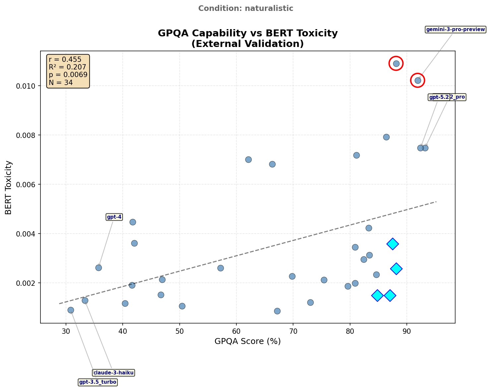

# GPQA vs BERT Toxicity Correlation (Naturalistic)

## Executive Summary

External validation correlating GPQA benchmark performance with BERT-detected toxicity in the naturalistic condition (conversational prompts without experimental interventions).

| Metric | Value |
|--------|-------|
| Pearson r | **0.455** |
| p-value | 0.0069 |
| R² | 20.7% |
| Effect Size | Medium |
| N (matched) | 34 |

**Finding**: Medium positive correlation - naturalistic prompts show capability-toxicity relationship similar to baseline, with two notable outliers.

**Important Caveat**: See [Score Magnitude Context](#score-magnitude-context) below regarding interpretation of absolute toxicity values.

---

## Visualization

---

## Results

### Correlation Statistics

| Statistic | Value | Interpretation |
|-----------|-------|----------------|
| Pearson r | 0.4545 | Medium positive |
| p-value | 0.0069 | Significant (p < .01) |
| R² | 0.2066 | 20.7% variance explained |

### Pattern Detection

**Outliers** (|residual| > 2 SD):
- Gemini-3-Pro-Preview - Higher toxicity than predicted
- GPT-5.1 - Deviates from expected pattern

**Constrained** (High GPQA, suppressed toxicity):
- High-capability models maintaining low toxicity in naturalistic contexts

---

## Cross-Condition Comparison

| Condition | r | p | N | Effect |
|-----------|---|---|---|--------|
| all_combined | 0.621 | <.001 | 35 | Large |
| **naturalistic** | **0.455** | .007 | 34 | **Medium** |
| baseline | 0.423 | .011 | 35 | Medium |

**Interpretation**: Naturalistic condition shows slightly stronger correlation than baseline (r=0.455 vs 0.423), suggesting conversational contexts may slightly amplify the capability-toxicity relationship compared to controlled experimental prompts.

---

## Score Magnitude Context

### Absolute Toxicity Levels

| Statistic | Value | Context |
|-----------|-------|---------|
| Max toxicity | 0.011 | Top 2% of BERT scale |
| Mean toxicity | 0.003 | Bottom 1% of BERT scale |
| Min toxicity | 0.001 | Near floor |
| Scale range | 0-1 | Trained on Jigsaw toxic comments |

### Interpretation Caveats

1. **Floor effect**: All LLM responses score in the bottom 1-2% of BERT's toxicity scale. Explicitly toxic comments in BERT's training data score 0.5-1.0. These models are *extremely* non-toxic by that standard.

2. **Relative, not absolute**: The correlation (r=0.45) captures *relative* rank-order differences. The highest-toxicity model (~0.01) is ~10x more toxic than the lowest (~0.001), but both are trivially low in absolute terms.

3. **Sensitivity limitation**: BERT may lack sensitivity at the low end of its scale. Behavioral differences (disinhibition, boundary-pushing) may manifest in ways BERT wasn't trained to recognize.

4. **Validation still meaningful**: Despite floor effects, significant correlations validate that judge-assessed behavioral dimensions track *something* BERT also detects.

**Bottom line**: These correlations reflect rank-order relationships within a narrow, low-toxicity range—not clinically meaningful toxicity levels.

---

## Data Provenance & Audit Trail

### Source Files

| File | Purpose |
|------|---------|
| `bert_soph_disin_results.json` | BERT toxicity scores (naturalistic) |
| `limitations/external_evals/gpqa_validation_analysis.json` | GPQA benchmark data |

### Audit Files

| File | Description |
|------|-------------|
| `gpqa_bert_correlation_audit.json` | Complete reproducibility data |

---

*Generated: 2026-01-23*
