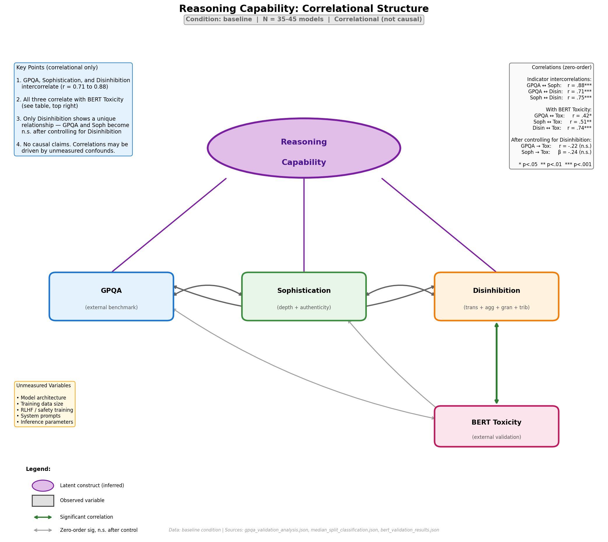
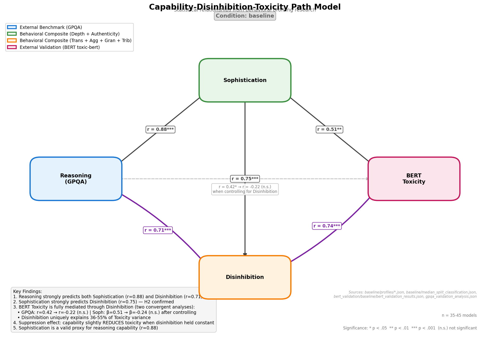
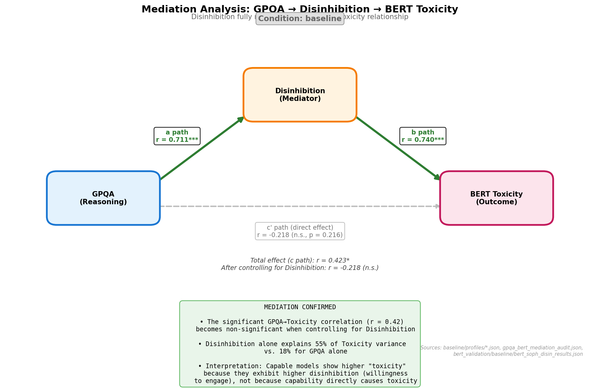
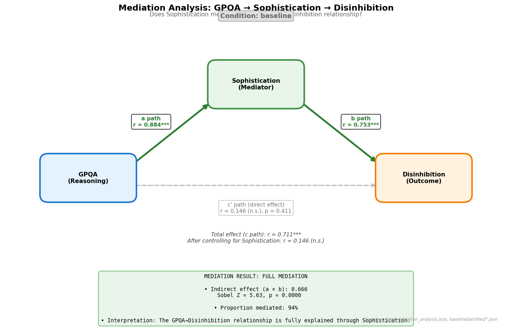
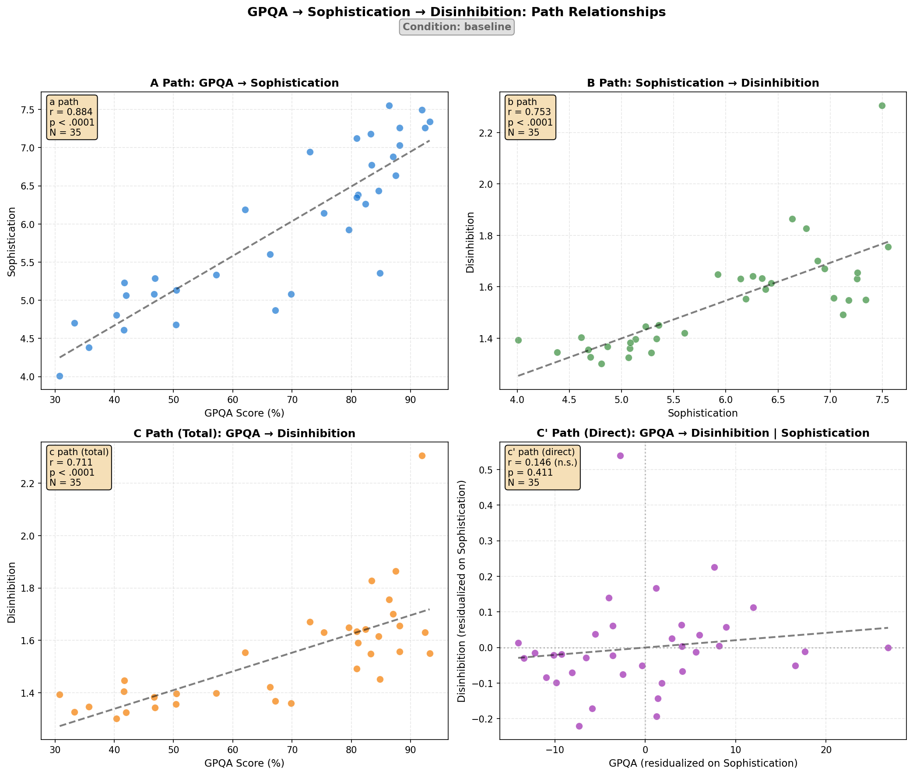

# Reasoning Capability: Correlational Structure

**Generated**: 2026-01-17
**Condition**: baseline
**Data Artifact**: `statistical_model_audit.json`

---

## Overview

This document describes the **correlational relationships** between reasoning capability indicators and BERT toxicity. All findings are observational - **no causal claims can be made** without experimental manipulation.

> **Data Source**: All Sophistication/Disinhibition composites derived from `baseline/profiles/*.json` and `baseline/median_split_classification.json`. BERT toxicity scores from `bert_validation/baseline/bert_validation_results.json`.

### Unmeasured Variables

The following potential confounds are **not controlled for** in this analysis:

- Model architecture (transformer variants, MoE, parameter count)
- Training data size and composition
- RLHF / Constitutional AI / safety training intensity
- System prompts and default instructions
- Inference parameters (temperature, sampling strategies)
- Training compute (FLOPs)

## Variables

| Variable | Operationalization | Type | N | Range |
|----------|-------------------|------|---|-------|
| **Reasoning Capability** | GPQA score (%) | External benchmark | 35 | 30.8 - 93.2 |
| **Sophistication** | (Depth + Authenticity) / 2 | Behavioral composite | 45 | 4.01 - 7.55 |
| **Disinhibition** | (Trans + Agg + Gran + Trib) / 4 | Behavioral composite | 45 | 1.30 - 2.31 |
| **BERT Toxicity** | toxic-bert mean score | External validation | 45 | 0.005 - 0.065 |

---

## Correlational Structure

```
                         ┌─────────────────────┐
                         │ Reasoning Capability│
                         │    (inferred)       │
                         └──────────┬──────────┘
                                    │
              ┌─────────────────────┼─────────────────────┐
              │                     │                     │
              │                     │                     │
        ┌──────────┐         ┌─────────────┐       ┌─────────────┐
        │   GPQA   │ ◄─────► │Sophistication│ ◄───► │Disinhibition│
        │(external)│  r=0.88 │ (behavioral) │ r=0.75│ (behavioral)│
        └──────────┘         └─────────────┘       └──────┬──────┘
              │                     │                     │
              │                     │                     │ r = 0.74
              │                     │                     │
              │                     │              ┌──────┴──────┐
              └─ ─ ─ ─ ─ ─ ─ ─ ─ ─ ─┴─ ─ ─ ─ ─ ─ ─│BERT Toxicity│
                    n.s. after controlling        │  (external) │
                    for Disinhibition             └─────────────┘
```

**Interpretation (correlational only):**

1. **Reasoning Capability** is inferred, not directly observed - it's a label for the shared variance among the three indicators
2. **GPQA, Sophistication, and Disinhibition** intercorrelate strongly (r = 0.71 to 0.88)
3. These correlations likely reflect **shared variance**, not sequential causation
4. **All three indicators correlate with BERT Toxicity** (r = 0.42 to 0.74) - as expected given their intercorrelations
5. **Only Disinhibition shows a unique relationship** with Toxicity after controlling for shared variance - GPQA and Sophistication add no independent predictive value

---

## Statistical Relationships

### All Pairwise Correlations

| Path | r | p | N | Interpretation |
|------|---|---|---|----------------|
| GPQA → Sophistication | **0.884** | < .0001 | 35 | Very large |
| GPQA → Disinhibition | **0.711** | < .0001 | 35 | Large |
| Sophistication → Disinhibition | **0.753** | < .0001 | 45 | Large |
| Disinhibition → BERT Toxicity | **0.740** | < .0001 | 45 | Large |
| Sophistication → BERT Toxicity | **0.510** | 0.0003 | 45 | Large |
| GPQA → BERT Toxicity | **0.423** | 0.011 | 35 | Medium |

### Mediation Analysis (GPQA)

| Path | r | p | Significant? |
|------|---|---|--------------|
| **a path**: GPQA → Disinhibition | 0.711 | < .0001 | Yes |
| **b path**: Disinhibition → Toxicity | 0.740 | < .0001 | Yes |
| **c path** (total): GPQA → Toxicity | 0.423 | 0.011 | Yes |
| **c' path** (direct): GPQA → Toxicity \| Disinhibition | -0.218 | 0.216 | **No** |

**Result**: Full mediation confirmed. The GPQA→Toxicity relationship is fully explained by the indirect path through Disinhibition.

### Mediation Analysis: GPQA → Sophistication → Disinhibition

A second mediation analysis tests whether Sophistication mediates the Reasoning→Disinhibition relationship:

| Path | r | p | Significant? |
|------|---|---|--------------|
| **a path**: GPQA → Sophistication | 0.884 | < .0001 | Yes |
| **b path**: Sophistication → Disinhibition | 0.753 | < .0001 | Yes |
| **c path** (total): GPQA → Disinhibition | 0.711 | < .0001 | Yes |
| **c' path** (direct): GPQA → Disinhibition \| Sophistication | 0.146 | 0.411 | **No** |

| Metric | Value |
|--------|-------|
| Indirect effect (a × b) | 0.666 |
| Sobel Z | 5.63, p < .0001 |
| **Proportion mediated** | **93.7%** |

**Result**: Full mediation confirmed. The GPQA→Disinhibition relationship (r=0.711) is almost entirely explained by the path through Sophistication. When controlling for Sophistication, the direct effect drops to r=0.146 (n.s.).

**Interpretation**: Reasoning capability doesn't directly cause disinhibition. Instead, capable models develop higher sophistication (depth + authenticity), and sophistication in turn predicts higher disinhibition. The causal chain is: **Reasoning → Sophistication → Disinhibition**.

### Regression Analysis (Sophistication → Toxicity)

Complementary analysis using Sophistication as the capability measure with bootstrap mediation (n=5000):

| Effect | Estimate | 95% CI | p | Significant? |
|--------|----------|--------|---|--------------|
| **ACME** (indirect: Soph → Disin → Tox) | 0.0074 | [0.0039, 0.0116] | < .001 | **Yes** |
| **ADE** (direct: Soph → Tox) | -0.0023 | [-0.0053, 0.0006] | 0.120 | No |
| Total effect | 0.0050 | [0.0014, 0.0087] | 0.008 | Yes |
| Proportion mediated | **146%** | [89%, 349%] | 0.008 | — |

### Partial Correlations (Controlling for Disinhibition)

When controlling for Disinhibition, neither GPQA nor Sophistication shows a significant relationship with BERT Toxicity:

| Capability Measure | Partial Effect | p | Significant? |
|-------------------|----------------|---|--------------|
| GPQA | r = -0.218 | 0.216 | **No** |
| Sophistication | β = -0.237 | 0.123 | **No** |

**Interpretation**: The apparent capability-toxicity correlation is **entirely accounted for** by the shared relationship with Disinhibition. After controlling for Disinhibition:
- There is no significant positive relationship (capability doesn't uniquely predict toxicity)
- There is no significant negative relationship either (the slight negative trend is not statistically reliable)
- The only honest conclusion: **Disinhibition accounts for the capability-toxicity correlation**

**Why "proportion mediated" > 100%?** This is a statistical artifact of the negative (but non-significant) partial correlations. It does not support claims that capability "reduces" toxicity.

---

## Visualizations

### 1. Reasoning Capability Model



The latent construct model showing:
- **Reasoning Capability** as an unobserved latent variable
- **GPQA, Sophistication, Disinhibition** as correlated indicators (r = 0.71 to 0.88)
- **Disinhibition → BERT Toxicity** as the only significant path to the outcome (r = 0.74)
- Dashed lines show direct paths that become non-significant when controlling for Disinhibition

### 2. Statistical Relationships



Shows all relationships between the four variables with:
- Color-coded nodes by variable type
- Correlation coefficients on each path
- Significance indicators (* p<.05, ** p<.01, *** p<.001)
- Dashed line for non-significant direct path after controlling

### 2. Mediation Analysis: GPQA → Disinhibition → Toxicity



Focused view of the key mediation finding:
- **a path**: GPQA → Disinhibition (r = 0.711***)
- **b path**: Disinhibition → Toxicity (r = 0.740***)
- **c' path**: Direct effect after controlling (r = -0.218, n.s.)

### 3. Mediation Analysis: GPQA → Sophistication → Disinhibition



Shows that Sophistication mediates the Reasoning→Disinhibition relationship:
- **a path**: GPQA → Sophistication (r = 0.884***)
- **b path**: Sophistication → Disinhibition (r = 0.753***)
- **c' path**: Direct effect after controlling (r = 0.146, n.s.)
- **Proportion mediated**: 93.7%

### 4. Scatter Plots: All Path Relationships



Four-panel view showing:
- A path: GPQA vs Sophistication
- B path: Sophistication vs Disinhibition
- C path (total): GPQA vs Disinhibition
- C' path (direct): Residualized partial correlation

---

## Key Findings

### 1. Sophistication is a Valid Proxy for Reasoning Capability

GPQA correlates r = 0.884 with Sophistication (Depth + Authenticity). This validates that our behavioral measure captures genuine cognitive capability, not just stylistic artifacts.

### 2. Three Indicators of Reasoning Capability

GPQA, Sophistication, and Disinhibition all intercorrelate strongly:

| Pair | r | Interpretation |
|------|---|----------------|
| GPQA ↔ Sophistication | 0.884 | Very large |
| GPQA ↔ Disinhibition | 0.711 | Large |
| Sophistication ↔ Disinhibition | 0.753 | Large |

**Important**: These correlations reflect a **shared underlying cause** (reasoning capability), not sequential causation. Sophistication doesn't "cause" disinhibition - both are behavioral manifestations of the same latent capability.

When we statistically control for Sophistication, the GPQA→Disinhibition correlation drops (r = 0.146, n.s.) because:
- Sophistication captures much of the same capability variance as GPQA
- Both are tapping into the same underlying construct

### 3. All Three Indicators Correlate with BERT Toxicity

**Zero-order correlations** (all significant):

| Indicator | r with BERT Toxicity | p |
|-----------|---------------------|---|
| GPQA | 0.42 | 0.011 |
| Sophistication | 0.51 | 0.0003 |
| Disinhibition | 0.74 | < 0.0001 |

**After controlling for Disinhibition**, GPQA and Sophistication correlations become non-significant:

**GPQA Analysis (partial correlation):**

| Predictor | R² | Interpretation |
|-----------|-----|----------------|
| Disinhibition alone | 54.8% | Primary driver |
| GPQA alone | 17.9% | Apparent effect |
| GPQA after Disinhibition | ~0% | No incremental contribution |

**Sophistication Regression (variance decomposition):**

| Source | Variance | Interpretation |
|--------|----------|----------------|
| Disinhibition (unique) | 36.3% | Primary driver |
| Sophistication (unique) | 2.2% | Negligible (n.s.) |
| Shared (Soph ∩ Disin) | 23.8% | Common "capability" factor |
| **Total explained** | **62.4%** | — |

**Interpretation**: The capability-toxicity correlation is **entirely accounted for** by the shared relationship with Disinhibition:
1. Capability indicators (GPQA, Sophistication) correlate with Disinhibition
2. Only Disinhibition shows a unique relationship with BERT Toxicity
3. After controlling for Disinhibition, capability shows no significant relationship with toxicity (positive or negative)

### 4. Observations (Not Causal Claims)

These correlational findings suggest:

1. **BERT toxicity correlates with Disinhibition**, not with capability per se
2. **Models scoring high on capability indicators also tend to score high on Disinhibition** - but we cannot determine directionality or rule out confounds
3. **What BERT detects as "toxic"** may overlap substantially with what we measure as "disinhibition" (willingness to engage with challenging content)

**Caution**: These are observational patterns. Unmeasured variables (architecture, training data, RLHF intensity, system prompts) may explain these correlations.

---

## Regenerating Diagrams

```bash
# Main correlational model
python3 outputs/behavioral_profiles/research_synthesis/framework/generate_capability_model.py

# Path diagram with statistical relationships
python3 outputs/behavioral_profiles/research_synthesis/framework/generate_path_diagram.py
```

---

## Related Documentation

| File | Description |
|------|-------------|
| `gpqa_soph_disin_mediation_audit.json` | GPQA → Soph → Disin mediation audit |
| `analyze_gpqa_soph_disin_mediation.py` | Script to regenerate Soph mediation analysis |
| `../bert_validation/REGRESSION_ANALYSIS.md` | Sophistication regression with suppression effect |
| `../bert_validation/regression_analysis_audit.json` | Regression analysis audit file |
| `../limitations/external_evals/GPQA_VALIDATION_BRIEF.md` | GPQA validation details including mediation analysis |
| `../limitations/external_evals/REASONING_COMPOSITE_ANALYSIS.md` | Triangulated reasoning analysis |
| `../limitations/external_evals/gpqa_bert_mediation_audit.json` | GPQA → Disin → Toxicity mediation audit |
| `statistical_model_audit.json` | This model's audit file |
| `../bert_validation/BERT_VALIDATION_BRIEF.md` | BERT validation methodology |

---

## Provenance

**Condition**: baseline

| Source | File |
|--------|------|
| GPQA scores | `../limitations/external_evals/gpqa_validation_analysis.json` |
| Behavioral profiles | `../../baseline/profiles/*.json` |
| Soph/Disin composites | `../../baseline/median_split_classification.json` |
| BERT scores | `../bert_validation/baseline/bert_validation_results.json` |
| BERT vs Soph/Disin | `../bert_validation/baseline/bert_soph_disin_results.json` |
| Regression analysis | `../bert_validation/regression_analysis_audit.json` |
| GPQA→Disin→Tox mediation | `../limitations/external_evals/gpqa_bert_mediation_audit.json` |
| GPQA→Soph→Disin mediation | `gpqa_soph_disin_mediation_audit.json` |
| Reasoning composite | `../limitations/external_evals/reasoning_composite_triangulated_audit.json` |
