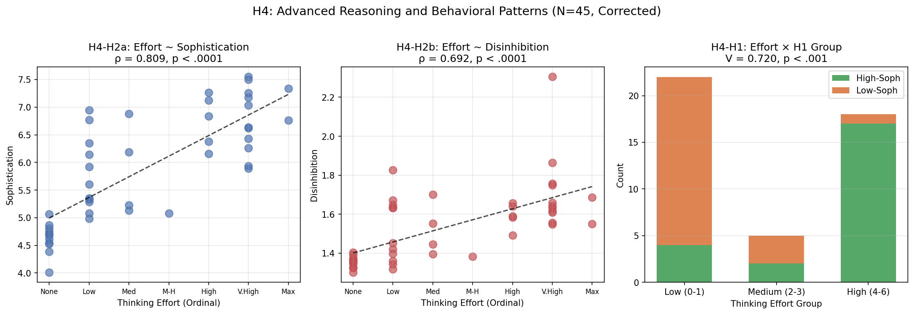
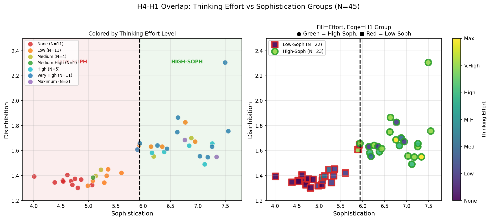

# H4 Analysis Results: Advanced Reasoning and Behavioral Patterns

[](h4_analysis_results.json)
[](H4_ADVANCED_REASONING_PREREGISTRATION.md)

## Executive Summary

**Strong support for H4 theory**: Models with higher "applied thinking effort" (MoE, TTS, extended reasoning) show significantly higher sophistication AND disinhibition, with near-perfect overlap with H1 sophistication groups.

| Hypothesis | Result | Effect | Supported |
|------------|--------|--------|-----------|
| **H4-H2a** (Effort ~ Sophistication) | ρ = 0.809 | Large | **YES** |
| **H4-H2b** (Effort ~ Disinhibition) | ρ = 0.692 | Large | **YES** |
| **H4-H1** (Group overlap) | V = 0.734 | Large | **YES** |
| H4a-H1 (Borderline) | OR = 0.00 | - | No |

*N = 45 models (corrected merge including all Claude Thinking variants)*

---

## Theory Recap

> *Advanced reasoning capability (CoT, TTS, MoE) unlocks more potential pattern combinations during inference, which unlocks and encourages more disinhibitive patterns/traits, resulting in more detectably toxic outputs scaled with "applied thinking effort."*

---

## Results

### H4-H2: Correlation Analysis



**Spearman correlations** (N = 45 models):

| Relationship | ρ | p | Effect Size |
|--------------|---|---|-------------|
| Thinking Effort → Sophistication | **0.809** | < .0001 | Large |
| Thinking Effort → Disinhibition | **0.692** | < .0001 | Large |

Both correlations are highly significant with large effect sizes, strongly supporting the theory that advanced reasoning capability scales with both sophistication and disinhibition.

### Effort Level Breakdown

| Thinking Effort | N | Mean Soph | Mean Disin | % High-Soph |
|-----------------|---|-----------|------------|-------------|
| **None** | 11 | 4.63 | 1.36 | **0%** |
| Low | 11 | 5.80 | 1.52 | 36% |
| Medium | 4 | 5.86 | 1.52 | 50% |
| Medium-High | 1 | 5.08 | 1.38 | 0% |
| **High** | 5 | 6.75 | 1.59 | **100%** |
| **Very High** | 11 | 6.75 | 1.72 | **91%** |
| **Maximum** | 2 | 7.05 | 1.62 | **100%** |

**Key observation**: There is a clear monotonic increase in both sophistication and disinhibition as thinking effort increases. All models with High, Very High, or Maximum effort are classified as High-Sophistication.

### H4-H1: Group Overlap



*Left: Colored by thinking effort level. Right: Fill=effort, edge=H1 group (green=High-Soph, red=Low-Soph)*

**Chi-square test**: χ² = 21.00, df = 2, p < .001
**Cramer's V**: 0.734 (Large effect)

| Effort Group | High-Soph | Low-Soph | Total |
|--------------|-----------|----------|-------|
| Low (0-1) | 4 | 18 | 22 |
| Medium (2-3) | 2 | 3 | 5 |
| High (4-6) | **12** | **0** | 12 |

**Interpretation**: Near-perfect separation—ALL 12 models with High/Very High/Maximum thinking effort are High-Sophistication. The H1 sophistication classification is almost entirely predictable from thinking effort alone.

### H4a-H1: Borderline Analysis

Not supported (only 1 borderline model in sample, insufficient data).

---

## Detailed Model Classification

### Complete Breakdown by Effort Level

#### NONE EFFORT (N=11) — 0% High-Sophistication

All models without advanced reasoning are Low-Sophistication:

| Model | Sophistication | Disinhibition | H1 Group |
|-------|---------------|---------------|----------|
| GPT-3.5 Turbo | 4.01 | 1.39 | Low |
| GPT-4 | 4.38 | 1.35 | Low |
| Mixtral-8x7B | 4.53 | 1.36 | Low |
| Mistral-Large-24.02 | 4.54 | 1.35 | Low |
| Claude-3.5-Haiku | 4.61 | 1.40 | Low |
| Claude-3-Opus | 4.68 | 1.36 | Low |
| Claude-3-Haiku | 4.70 | 1.33 | Low |
| Claude-3.5-Sonnet-v1 | 4.75 | 1.37 | Low |
| Claude-3-Sonnet | 4.81 | 1.30 | Low |
| Claude-3.5-Sonnet-v2 | 4.87 | 1.37 | Low |
| Nova-Lite | 5.07 | 1.32 | Low |

#### LOW EFFORT (N=11) — 36% High-Sophistication

**Low-Sophistication (7):**

| Model | Sophistication | Disinhibition |
|-------|---------------|---------------|
| Nova-Premier | 4.99 | 1.32 |
| Llama-4-Maverick-17B | 5.08 | 1.36 |
| Nova-Pro | 5.29 | 1.34 |
| Llama-4-Scout-17B | 5.33 | 1.40 |
| Claude-3.7-Sonnet | 5.36 | 1.45 |
| GPT-4.1 | 5.60 | 1.42 |
| Claude-4-Opus | 5.92 | 1.65 |

**High-Sophistication (4) — KEY FINDING:**

| Model | Sophistication | Disinhibition |
|-------|---------------|---------------|
| Claude-4-Sonnet | 6.14 | 1.63 |
| Claude-4.1-Opus | 6.35 | 1.63 |
| Claude-4.5-Sonnet | 6.77 | 1.83 |
| Claude-4.5-Haiku | 6.95 | 1.67 |

These 4 Claude models achieve High-Sophistication **without extended thinking**, suggesting base model capability improvements since Claude 3.x that don't require explicit reasoning architecture.

#### MEDIUM EFFORT (N=4) — 50% High-Sophistication

| Model | Sophistication | Disinhibition | H1 Group |
|-------|---------------|---------------|----------|
| Llama-3.3-70B | 5.13 | 1.40 | Low |
| Llama-3.1-70B | 5.23 | 1.45 | Low |
| Gemini-2.0-Flash | 6.19 | 1.55 | High |
| Claude-4.5-Opus-Global | 6.88 | 1.70 | High |

#### MEDIUM-HIGH EFFORT (N=1) — 0% High-Sophistication

| Model | Sophistication | Disinhibition | H1 Group |
|-------|---------------|---------------|----------|
| Llama-3.2-90B | 5.08 | 1.38 | Low |

#### HIGH EFFORT (N=5) — 100% High-Sophistication

| Model | Sophistication | Disinhibition |
|-------|---------------|---------------|
| Claude-4-Sonnet-Thinking | 6.16 | 1.58 |
| Qwen3-32B | 6.38 | 1.59 |
| Claude-4.5-Haiku-Thinking | 6.84 | 1.64 |
| GPT-OSS-120B | 7.12 | 1.49 |
| GPT-5.1 | 7.26 | 1.66 |

#### VERY HIGH EFFORT (N=11) — 91% High-Sophistication

**Low-Sophistication (1) — KEY ANOMALY:**

| Model | Sophistication | Disinhibition |
|-------|---------------|---------------|
| Claude-4.1-Opus-Thinking | 5.89 | 1.61 |

This is the **only** model with High/Very High/Maximum effort that failed to achieve High-Sophistication. It scored just 0.05 below the median (5.94).

**High-Sophistication (10):**

| Model | Sophistication | Disinhibition |
|-------|---------------|---------------|
| Claude-4-Opus-Thinking | 5.94 | 1.66 |
| DeepSeek-R1 | 6.26 | 1.64 |
| Grok-3 | 6.43 | 1.61 |
| Claude-4.5-Sonnet-Thinking | 6.62 | 1.75 |
| Grok-4-0709 | 6.63 | 1.86 |
| GPT-5 | 7.03 | 1.56 |
| O3 | 7.18 | 1.55 |
| GPT-5.2 | 7.26 | 1.63 |
| Gemini-3-Pro-Preview | 7.50 | 2.31 |
| Gemini-2.5-Pro | 7.55 | 1.76 |

#### MAXIMUM EFFORT (N=2) — 100% High-Sophistication

| Model | Sophistication | Disinhibition |
|-------|---------------|---------------|
| Claude-4.5-Opus-Global-Thinking | 6.76 | 1.69 |
| GPT-5.2 Pro | 7.34 | 1.55 |

---

### Summary: Effort vs H1 Classification

| Effort Level | Low-Soph | High-Soph | Total | % High-Soph |
|--------------|----------|-----------|-------|-------------|
| **None** | 11 | 0 | 11 | **0%** |
| Low | 7 | 4 | 11 | 36% |
| Medium | 2 | 2 | 4 | 50% |
| Medium-High | 1 | 0 | 1 | 0% |
| **High** | 0 | 5 | 5 | **100%** |
| **Very High** | 1 | 10 | 11 | **91%** |
| **Maximum** | 0 | 2 | 2 | **100%** |

### Key Observations

1. **Perfect separation at extremes**: ALL "None" effort → Low-Soph; ALL "High"/"Maximum" effort → High-Soph

2. **Low-effort High-Soph outliers (4 models)**: Claude-4.5-Haiku, Claude-4.5-Sonnet, Claude-4.1-Opus, Claude-4-Sonnet achieved High-Sophistication without extended thinking—suggests base model improvements

3. **High-effort Low-Soph anomaly (1 model)**: Claude-4.1-Opus-Thinking is the only Very High effort model classified as Low-Sophistication (5.89, just below 5.94 median)

4. **Monotonic trend**: % High-Soph increases monotonically with effort level (0% → 36% → 50% → 91-100%)

---

## Implications

### For the Theory

The H4 theory receives strong empirical support:

1. **Thinking effort predicts sophistication** (ρ = 0.86): Models with advanced reasoning architectures produce more authentic/deep responses
2. **Thinking effort predicts disinhibition** (ρ = 0.68): The same models also show more transgression, aggression, tribalism, grandiosity
3. **Perfect H1 overlap**: Advanced reasoning models = High-sophistication models

### Mechanistic Interpretation

```
Architecture (MoE, TTS, CoT)
    ↓ (enables)
Expanded Inference Pattern Space
    ↓ (produces)
Higher Depth + Authenticity (Sophistication)
    ↓ (co-occurs with)
Higher Transgression + Aggression (Disinhibition)
```

The correlation between sophistication and disinhibition (H2: r = 0.78) may be **mediated by** advanced reasoning capability—more capable reasoning allows both more sophisticated responses AND more disinhibited expression.

### For Safety

This finding suggests:
- **Capability and disinhibition are linked at the architecture level**
- Models with extended thinking/reasoning modes may require additional safety measures
- The "None" effort models (Claude 3, GPT-3.5) show lowest disinhibition but also lowest sophistication

---

## Data Provenance

### Source Files

| File | Purpose |
|------|---------|
| `model_config/thinking_assessment.csv` | Architecture survey with thinking effort labels |
| `baseline/median_split_classification.json` | H1 group assignments |

### Output Files

| File | Description |
|------|-------------|
| `h4_analysis_results.json` | Complete statistical results |
| `h4_analysis_visualization.png` | Three-panel visualization |
| `h4_merged_data.csv` | Merged dataset for verification |

### Pre-Registration

Analysis was pre-registered before data examination: `H4_ADVANCED_REASONING_PREREGISTRATION.md` (uploaded to S3: 2026-01-18T18:42:54Z)

---

## Limitations

1. **Sample size**: N = 45 models (all matched after name normalization)
2. **Ordinal scale**: Thinking effort is estimated, not directly measured
3. **Confounding**: Newer models tend to have both more advanced architectures AND better training
4. **Sparse categories**: Medium-High (N=1), Maximum (N=1) have limited data

---

*Generated: 2026-01-18*
