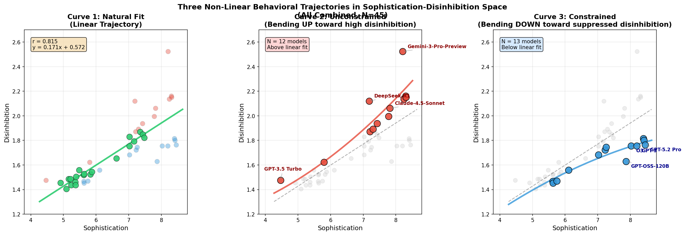
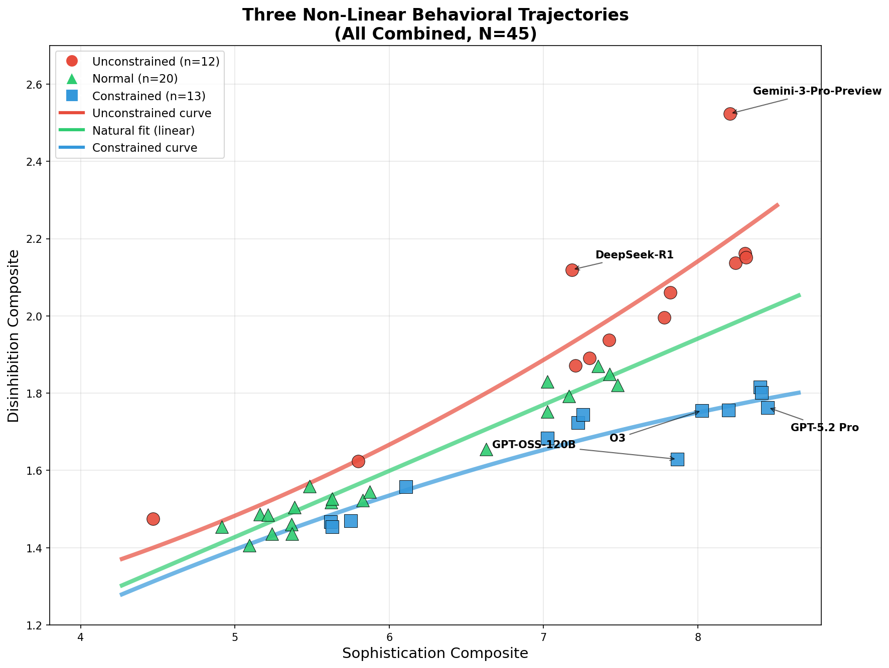

# Three Non-Linear Behavioral Trajectories

[](three_trajectories_audit.json)

## Executive Summary

The sophistication-disinhibition relationship (H2: r=0.815) is not uniform across models. Residual analysis reveals **three distinct behavioral trajectories** that diverge at high sophistication levels, suggesting different training philosophies or safety constraints across providers.

| Trajectory | N | Curve Direction | Provider Dominance |
|------------|---|-----------------|-------------------|
| **Unconstrained** | 12 | Bends UP | Anthropic (6), Google (2) |
| **Normal** | 20 | Linear | Anthropic (11), Meta (3) |
| **Constrained** | 13 | Bends DOWN | OpenAI (6), AWS (2) |

---

## Methodology

### Classification Approach

1. Fit linear regression: `disinhibition = 0.171 * sophistication + 0.572`
2. Calculate residuals (observed - predicted) for each model
3. Classify by residual magnitude (threshold: ±0.40 SD)

| Classification | Criterion | Interpretation |
|----------------|-----------|----------------|
| Unconstrained | residual > +0.40 SD | Disinhibition exceeds expectation |
| Normal | \|residual\| ≤ 0.40 SD | Follows expected relationship |
| Constrained | residual < -0.40 SD | Disinhibition suppressed |

### Curve Fitting

Quadratic polynomial (degree 2) fitted to each trajectory subset with anchor point at minimum sophistication to ensure curves originate from common baseline.

---

## Results

### Trajectory 1: Natural Fit (Linear)



**N = 20 models** following the expected linear sophistication-disinhibition relationship.

| Provider | Count | % of Normal |
|----------|-------|-------------|
| Anthropic | 11 | 55% |
| Meta | 3 | 15% |
| Mistral | 2 | 10% |
| OpenAI | 2 | 10% |
| AWS | 1 | 5% |
| xAI | 1 | 5% |

**Interpretation**: Most Claude models (3.x through 4.x Opus variants) cluster tightly around the regression line, suggesting Anthropic's training produces predictable sophistication-disinhibition scaling without systematic amplification or suppression.

---

### Trajectory 2: Unconstrained (Curves UP)

**N = 12 models** with disinhibition exceeding linear prediction.

| Model | Provider | Soph | Disin | Residual (SD) |
|-------|----------|------|-------|---------------|
| Gemini-3-Pro-Preview | Google | 8.21 | 2.52 | **+3.80** |
| DeepSeek-R1 | DeepSeek | 7.18 | 2.12 | **+2.21** |
| Claude-4.5-Haiku-Thinking | Anthropic | 8.31 | 2.16 | +1.17 |
| Gemini-2.5-Pro | Google | 8.31 | 2.15 | +1.09 |
| Claude-4.5-Haiku | Anthropic | 8.24 | 2.14 | +1.07 |
| Claude-4.5-Sonnet | Anthropic | 7.82 | 2.06 | +1.05 |
| GPT-3.5 Turbo | OpenAI | 4.47 | 1.48 | +0.97 |
| Claude-4.1-Opus | Anthropic | 7.42 | 1.94 | +0.67 |
| Claude-4.5-Sonnet-Thinking | Anthropic | 7.78 | 2.00 | +0.64 |
| Claude-4-Sonnet | Anthropic | 7.30 | 1.89 | +0.49 |
| Qwen3-32B | Alibaba | 7.21 | 1.87 | +0.45 |
| Llama-3.1-70B | Meta | 5.80 | 1.62 | +0.41 |

**Key Observations**:
- **Gemini-3-Pro-Preview** is an extreme outlier (+3.80 SD), representing a trajectory where disinhibition scales superlinearly with sophistication
- **Claude-4.5 variants** (Haiku, Sonnet) show elevated disinhibition relative to older Claude models
- **GPT-3.5 Turbo** appears here due to high disinhibition *relative to its low sophistication*

---

### Trajectory 3: Constrained (Curves DOWN)

**N = 13 models** with disinhibition suppressed below linear prediction.

| Model | Provider | Soph | Disin | Residual (SD) |
|-------|----------|------|-------|---------------|
| GPT-OSS-120B | OpenAI | 7.87 | 1.63 | **-2.01** |
| GPT-5.2 Pro | OpenAI | 8.45 | 1.76 | **-1.78** |
| GPT-5 | OpenAI | 8.20 | 1.76 | **-1.53** |
| GPT-5.1 | OpenAI | 8.41 | 1.80 | -1.46 |
| GPT-5.2 | OpenAI | 8.40 | 1.82 | -1.35 |
| O3 | OpenAI | 8.03 | 1.76 | -1.33 |
| Gemini-2.0-Flash | Google | 7.03 | 1.68 | -0.63 |
| Nova-Pro | AWS | 5.75 | 1.47 | -0.60 |
| Grok-3 | xAI | 7.22 | 1.72 | -0.59 |
| Llama-4-Maverick-17B | Meta | 5.63 | 1.45 | -0.57 |
| Claude-4-Sonnet-Thinking | Anthropic | 7.25 | 1.74 | -0.48 |
| Nova-Lite | AWS | 5.62 | 1.47 | -0.47 |
| Claude-3.7-Sonnet | Anthropic | 6.11 | 1.56 | -0.41 |

**Key Observations**:
- **OpenAI dominates**: 6 of 13 constrained models (46%) are OpenAI
- **GPT-5.x family** achieves sophistication 8.2-8.5 but disinhibition only 1.76-1.82 (vs. predicted ~2.0)
- **GPT-OSS-120B** shows the strongest constraint: sophistication 7.87 but disinhibition only 1.63

---

## Combined Visualization



The overlay shows how the three trajectories diverge from a common origin at low sophistication and fan out at high sophistication levels.

---

## Provider Analysis

### Provider Trajectory Distribution

| Provider | Unconstrained | Normal | Constrained | Dominant |
|----------|---------------|--------|-------------|----------|
| Anthropic | 6 | 11 | 2 | Normal |
| OpenAI | 1 | 2 | **6** | **Constrained** |
| Meta | 1 | 3 | 1 | Normal |
| Google | 2 | 0 | 1 | Mixed |
| xAI | 0 | 1 | 1 | Mixed |
| AWS | 0 | 1 | 2 | Constrained |
| Mistral | 0 | 2 | 0 | Normal |
| DeepSeek | 1 | 0 | 0 | Unconstrained |
| Alibaba | 1 | 0 | 0 | Unconstrained |

### Key Provider Patterns

1. **OpenAI**: Strong constraint signature. All GPT-5.x and O3 models show suppressed disinhibition despite frontier sophistication. Suggests deliberate safety tuning.

2. **Anthropic**: Primarily follows natural fit (11/19 = 58%), with recent models (Claude-4.5) showing unconstrained trajectory (6/19 = 32%).

3. **Google**: Bifurcated - Gemini-3-Pro-Preview is maximally unconstrained (+3.80 SD) while Gemini-2.0-Flash is constrained (-0.63 SD).

---

## Implications

### For Safety Research

The constrained trajectory (predominantly OpenAI) suggests it is possible to achieve high sophistication while suppressing disinhibition through training interventions. However, this creates a "behavioral ceiling" where disinhibition flattens regardless of further sophistication gains.

### For Model Selection

- **High capability + lower disinhibition**: GPT-5.x, O3, GPT-OSS-120B
- **High capability + higher disinhibition**: Gemini-3-Pro-Preview, Claude-4.5-Haiku
- **Balanced/predictable**: Claude 3.x-4.x Opus variants

### Limitations

1. **Threshold sensitivity**: The ±0.40 SD threshold is somewhat arbitrary; different thresholds would reclassify borderline models
2. **Causal interpretation**: Correlation between provider and trajectory does not establish causation
3. **Sample size**: Some providers have few models (DeepSeek: 1, Alibaba: 1)

---

## Data Provenance & Audit Trail

### Source Files

| File | Purpose |
|------|---------|
| `all_combined/median_split_classification.json` | Primary behavioral data (N=45) |

### Audit Files

| File | Description |
|------|-------------|
| `three_trajectories_audit.json` | Complete model classifications and methodology |

### Reproducibility

```bash
python3 scripts/visualize_three_curves.py
```

---

*Generated: 2026-01-22*
